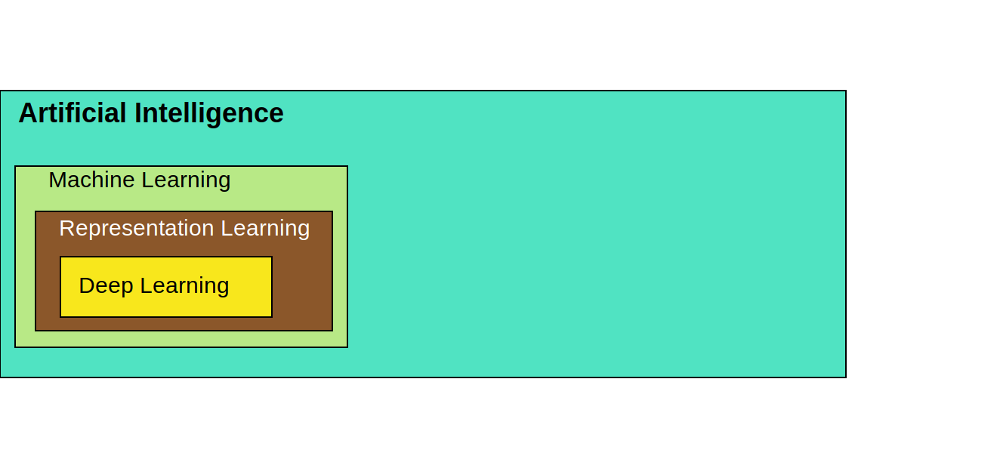

## Ian Goodfellow: Generative Adversarial Networks (GANs) | MIT Artificial Intelligence (AI) Podcast | April 18, 2019

This is a quick transcript of the interview of Ian Goodfellow by [Lex Fridman](https://www.linkedin.com/in/lexfridman). The interview has been published in [YouTube](https://www.youtube.com/watch?v=Z6rxFNMGdn0) as well as a podcast. Goodfellow points at so many areas in the future  where ML and AI could bring astonishing discoveries. Enjoy! *Alfonso R. Reyes. The Woodlands, Texas.*

## Interview to Ian Goodfellow

*The following is a conversation with Ian Goodfellow. He's the author of the popular textbook on deep learning simply titled "Deep Learning." He  coined the term of Generative Adversarial Networks, otherwise known as  GANs, and with his 2014 paper is responsible for launching the  incredible growth of research and innovation in this subfield of deep  learning. He got his BS and MS at Stanford, his PhD at University of  Montreal with Yoshua Bengio and Erin Courville. He held several research positions including an open AI Google brain and now at Apple as the  director of machine learning. This recording happened while Ian was  still a Google Brain but we don't talk about anything specific to Google or any other organization. This conversation is part of the Artificial  intelligence podcast. If you enjoy it, subscribe on YouTube, iTunes, or  simply connect with me on Twitter at @lexfridman. Now, here's my  conversation with Ian Goodfellow.*

### *On Deep Learning*

**[Lex]** You open your popular "Deep Learning" book with a Russian doll type diagram that shows deep learning is a subset of representation learning, which  in turn is a subset of machine learning, and finally a subset of AI. This kind of implies that there may be limits to deep learning in the  context of AI. What do you think is the current limits of deep learning  and are those limits something that we can overcome with time?

**[Ian]** I think one of the biggest limitations of deep learning is that right now it requires really a lot of data, especially labeled data. There's some unsupervised and semi-supervised learning algorithms that can reduce  the amount of labeled data you need, but they still require a lot of  unlabeled data. Reinforcement Learning algorithms they don't need labels but they need really a lot of experiences. As human beings we don't  want to play Pong by failing at Pong two million times. So, just getting the generalization ability better is one of the most important  bottlenecks and the capability of the technology today. Then, I guess,  I'd also say deep learning is like a component of a bigger system. So far, nobody is really proposing to have only what you'd call deep  learning as the entire ingredient of intelligence. You use deep learning as sub-modules of other systems. Like Alpha-Go has a deep learning  model that estimates the value function, most reinforcement learning  algorithms have a deep learning module that estimates which action to  take next but you might have other components.

**[Lex]** Here basically, as building a function estimator, do you think it's possible -you said nobody is kind of in thinking about this so far-, but do you  think neural networks could be made to reason in the way symbolic  systems did in the 80s and 90s, to do more, create more, like programs  as opposed to functions?

**[Ian]** Yes. I think we already see that a little bit. I already kind of think of neural nets as a kind of  program. I think of deep learning as basically learning programs that  have more than one step. So if you draw a flowchart, or if you draw a  TensorFlow graph describing your machine learning model, I think of the  depth of that graph is describing the number of steps that run in  sequence, and then the width of that graph is the number of steps that  run in parallel. Now it's been long enough that we've had deep learning  working that it's a little bit silly to even discuss shallow learning  anymore. But back when I first got involved in AI, when we used machine  learning, we were usually learning things like Support Vector Machines;  you could have a lot of input features to the model and you could  multiply each feature by a different weight but all those  multiplications were done in parallel to each other; there wasn't a lot  done in series. I think what we got with deep learning was really the  ability to have steps of a program that run in sequence. And I think  that we've actually started to see that what's important with deep  learning is more the fact that we have a multi-step program rather than  the fact that we've learned a representation. If you look at things like ResNet, for example, they take one particular kind of representation  and they update it several times. Back when deep learning first really  took off in the academic world in 2006, when Geoff Hinton showed that  you could train deep belief networks. Everybody, who was interested in the idea, thought of it as each layer learns a different level of  abstraction, but the first layer trained on images learns something like edges, and the second layer learns corners, and eventually you get  these kind of grandmother's cell units that recognize specific objects.  Today, I think, most people think of it more as a computer program where as you add more layers you can do more updates before you output your  final number. But I don't think anybody believes the layer 150 of the  ResNet it is a grand grandmother cell, and layer 100 is contours, or  something like that.

**[Lex]** You think, you're not thinking of it as a singular representation that keeps building, you think of it as a program, sort of almost like a state, the representation is a state of understanding ... ?

**[Ian]** Yes. I think of it as a program that makes several updates and arrives it better and better understanding. But it's not replacing the representation at each step;  its refining it. And in some sense that's a little bit like reasoning.  It's not reasoning in the form of deduction but it's reasoning in the  form of taking a thought and refining it, and refining it carefully, until it's good enough to use.

### Are cognition and consciousness in AI near?

**[Lex]** Do you think - and I hope you don't mind, we'll jump philosophical every  once in a while -, do you think of cognition -human cognition-, or even  consciousness, as simply a result of this kind of sequential  representation learning? Do you think that can emerge?

**[Ian]** Cognition, yes. I think so. Consciousness it's really hard to even define what we  mean by that. I guess there's consciousness is often defined as things  like having self-awareness, and that's relatively easy to turn into  something actionable for a computer scientists to reason about. People  also defined consciousness in terms of having qualitative states of  experience like *qualia* and there's all these philosophical  problems like .... "Could you imagine a zombie who does all the same  information processing as a human but doesn't really have the  qualitative experiences that we have?" That sort of thing, I have no  idea how to formalize, or turn it into a scientific question. I don't  know how you could run in experiment to tell whether a person is a  zombie or not. And similarly, I don't know how you could run an  experiment to tell whether an advanced AI system had become conscious in the sense of qualia or not.

**[Lex]** In the more practical  sense, like almost self attention, you think consciousness and cognition can, in an impressive way, emerge from current types of architectures  ...?

**[Ian]** Yes. Or if you think of consciousness in terms  of self-awareness and just making plans based on the fact that the agent itself exists in the world. Reinforcement Learning algorithms are  already more or less forced to model the agent's effect on the  environment. So that's more limited version of consciousness is already  something that we get limited versions of, with reinforcement learning  algorithms if they're trained well.

### More computation, more data and multimodal data

**[Lex]** But you say limited ... the big question really is how you jump from  limited to human level [yeah right], and whether it's possible that even just building common-sense reasoning seems to be exceptionally  difficult. So, if we scale things up, get much better on supervised  learning. if we get better at labeling, if we get bigger datasets, and  more compute, do you think we'll start to see really impressive things  that go from limited to, you know, something echoes of human level  cognition?

**[Ian]** I think so. I'm optimistic about what can happen just with more computation and more data. I do think it'll be  important to get the right kind of data. Today, most of the machine  learning systems we train our mostly trained on one type of data for  each model but the human brain we get all of our different senses, and  we have many different experiences like: riding a bike, driving a car,  talking to people, reading. I think when you get that kind of integrated dataset working with a machine learning model that can actually close  the loop and interact, we may find that algorithms not so different from what we have today; learn really interesting things when you scale them up a lot and a large amount of multimodal data.

### The impact of adversarial examples

**[Lex]** So, multimodal is really interesting but within ... -you're working  adversarial examples, so selecting within modal, within up one mode of  data, selecting better, what are the difficult cases from which are most useful to learn from?

**[Ian]** We could get a whole lot of  mileage out of designing a model that's resistant to adversarial  examples, or something like that? [right, yeah]. My thinking on that has evolved a lot over the last few years. When I first started to really  invest in studying adversarial examples, I was thinking of it mostly as  that adversarial examples reveal a big problem with machine learning, and we would like to close the gap between how machine learning models  respond to adversarial examples, and how humans respond. After studying  the problem more, I still think that adversarial examples are important. I think of them now more of as a security liability than as an issue  that necessarily shows there something uniquely wrong with machine  learning as opposed to humans.

**[Lex]** Also, do you see them as a tool to improve the performance of the system, not on the security side, but literally just accuracy?

**[Ian]** I do see them as a kind of tool on that side but maybe not quite as much  as I used to think. We've started to find that there's a trade-off  between accuracy on adversarial examples, and accuracy on clean  examples. Back in 2014, when I did the first adversarial trained  classifier that showed resistance to some kinds of adversarial examples, it also got better at the clean data on MNIST, and that's something  we've replicated several times in MNIST, that when we train against weak adversarial examples, MNIST classifiers get more accurate. So far, that hasn't really held up on other datasets, and hasn't held up when we  train against stronger adversaries. It seems like when you confront a  really strong adversary you tend to have to give something up.

**[Lex]** Interesting. This is such a compelling idea because it feels it feels like that's  how us, humans, learn [yeah] the difficult cases ...

**[Ian]** We try to think of what would we screw up and then we make sure we fix  that. It's also in a lot of branches of engineering you do a worst case  analysis and make sure that your system will work in the worst case, and then that guarantees that it'll work in all of the messy average cases  that happen when you go out into a really randomized world.

**[Lex]** With driving, with autonomous vehicles there seems to be a desire to just  look for "think adversarialy", tried to figure out how to mess up the  system, and if you can be robust to all those difficult cases then you  can; it's a hand waving empirical way to show that your system is ...

**[Ian]** Yes. Today most adversarial examples research isn't really focused on a particular use case but there are a lot of different use cases where  you'd like to make sure that the adversary can't interfere with the  operation of your system. Like in finance, if you have an algorithm  making trades for you, people go to a lot of an effort to obfuscate  their algorithm that's both to protect their IP because you don't want  to research and develop a profitable trading algorithm then have  somebody else capture the gains, but it's at least partly because you  don't want people to make adversarial examples that fool your algorithm  into making bad trades. I guess one area that's been popular in the  academic literature is speech recognition. If you use speech recognition to hear an audio waveform and then and turn that into a command that a  phone executes for you. You don't want some malicious adversary to be  able to produce audio that gets interpreted as malicious commands,  especially if a human in the room doesn't realize that something like  that is happening.

**[Lex]** in speech recognition has there been much success in being able to create adversarial examples that fool the system?

**[Ian]** Yeah. Actually I guess the first work that I'm aware of is a paper called  "Hidden voice commands" that came out in 2016, I believe. And they were  able to show that they could make sounds that are not understandable by a human but are recognized as the target phrase that the attacker wants  the phone to recognize it as. Since then, things have gotten a little  bit better on the attacker side when worse on the defender side. It's  become possible to make sounds that sound like normal speech but are  actually interpreted as a different sentence than the human hears. The  level of perceptibility of the adversarial perturbation is still kind of high the when you listen to the recording it sounds like there's some  noise in the background, just like rustling sounds, but those rustling  sounds are actually the adversarial perturbation that makes the phone  hear a completely different sentence.

### On writing the Deep Learning chapter for a new AI book

**[Lex]** That's so fascinating. Peter Norvig mention that you're writing the deep  learning chapter for the fourth edition of the "Artificial Intelligence, A Modern Approach" book. So how do you even begin summarizing the field of deep learning in a chapter?

**[Ian]** Well, in my case I  waited like a year before I actually read anything. Even having written a full length textbook before it's still pretty intimidating to try to  start writing just one chapter that covers everything. One thing that  helped me make that plan was actually the experience of having reading  the full book before, and then watching how the field changed after the  book came out. I realized there's a lot of topics that were maybe  extraneous in the first book, and just seeing what stood the test of a  few years of being published, and what seems a little bit less important to have included now helped me pare down the topics I wanted to cover  for the book. It's also really nice now that the field is kind of  stabilized to the point where some core ideas from the 1980s are still  used today. When I first started studying machine learning almost  everything from the 1980s had been rejected and now some of it has come  back; so that stuff that's really stood the test of time is what I  focused on putting into the book. There's also, I guess, two different  philosophies about how you might write a book. One philosophy is you try to write a reference that covers everything; and the other philosophy  is you try to provide a high level summary that gives people the  language to understand a field, and tells them what the most important  concepts are. The first deep learning book that I wrote with Yoshua [Bengio] and Aaron [Corville], was somewhere between the the two  philosophies that it's trying to be both a reference and an introductory guide. Writing this chapter for Russell and Norvig book I was able to  focus more on just a concise introduction of the key concepts, and the  language you need to read about them more. And a lot of cases actually  just wrote paragraphs that said "here's a rapidly evolving area that you should pay attention to. It's pointless to try to tell you what the  latest and best version of a learn-to-learn model is." You know I can I  can point you to a paper that's recent right now but there isn't a whole lot of a reasons to delve into exactly what's going on with the latest  learning-to-learn approach or the latest module produced by  learning-to-learn algorithm you should know that learning-to-learn is a  thing and that it may very well be the source of the latest and greatest convolutional net or recurrent net module that you would want to use in your latest project but there isn't a lot of point in trying to  summarize exactly which architecture in which learning approach got to  which level of performance.

**[Lex]** So you maybe focus more on the basics, on the methodology? From back propagation to feed-forward  to recur in your networks convolutional, that kind of thing?

**[Ian]** Yeah, yeah.

### What is Deep Learning, really?

**[Lex]** So, if I were to ask you I remember I took algorithms and data structures  algorithm course. Remember the professor asked what is an algorithm, and yelled at everybody, in a good way, that nobody was answering it  correctly. Everybody knew what the algorithm - it was graduate course.  Everybody knew what an algorithm was but they weren't able to answer it  well. Let me ask you, in that same spirit. What is Deep Learning?

**[Ian]** I would say deep learning is any kind of machine learning that involves  learning parameters of more than one consecutive step. I mean shallow  learning is things where you learn a lot of operations that happen in  parallel. You might have a system that makes multiple steps, like you  might have hand designed feature extractors but really only one step is  learned. Deep learning is anything where you have multiple operations in sequence. And, that includes the things that are really popular today  like convolutional networks and recurrent networks. But it also includes some of the things that have died out like Boltzmann machines, where we weren't using back propagation. Today, I hear a lot of people define  deep learning as gradient descent applied to these differentiable  functions, and I think that's a legitimate usage of the term, it's just  different from the way that I use the term myself.

**[Lex]** What's an example of deep learning that is not gradient descent on  differentiable functions? I mean, not specifically perhaps but more,  even looking into the future? What's your thought about that space of  approaches?

**[Ian]** I tend to think of machine learning  algorithms as decomposed into really three different pieces there's the  model which can be something like a neural net, or a Boltzmann machine, or a recurrent model, and I basically just described how do you take  data and how do you take parameters, and what function do you use to  make a prediction given the data and the parameters. Another piece of  the learning algorithm is the optimization algorithm. Or, not every  algorithm can be really described in terms of optimization, but what's  the algorithm for updating the parameters or updating whatever the state of the network is? And then, the last part is the the dataset. Like how do you actually represent the world as it comes into your machine  learning system. So, I think of deep learning as telling us something  about what does the model look like, and basically to qualify as deep I say that it just has to have multiple layers. That can be multiple steps in a feed-forward differentiable computation; that can be multiple  layers in a graphical model; there's a lot of ways that you could  satisfy me that something has multiple steps that are each parameterized separately. I think of gradient descent as being all about that other piece: the how do you actually update the parameters piece. So, you can  imagine having a deep model like a convolutional net and training it  with something like evolution, or a genetic algorithm, and I would say  that still qualifies as deep learning. And then in terms of models that  aren't necessarily differentiable, I guess Boltzmann machines are  probably the main example of something where you can't really take a  derivative and use that for the learning process, but you can still  argue that the model has many steps of processing that it applies when  you run inference in the model.

### The future of back-propagation

**[Lex]** That's the steps of processing, that's key. Geoff Hinton suggests that we need to throw away back prop, back propagation, and start all over. What do  you think about that what could an alternative direction of training  neural networks look like?

**[Ian]** I don't know that back  propagation is going to go away entirely. Most of this time when we  decide that a machine learning algorithm isn't on the critical path to  research for improving AI. The algorithm doesn't die it just becomes  used for some specialized set of things. A lot of algorithms like  logistic regression don't seem that exciting to AI researchers who are  working on things like speech recognition or autonomous cars today, but  there's still a lot of use for logistic regression and things like  analyzing really noisy data in medicine and finance, or making really  rapid predictions in really time-limited contexts. So, I think I think  back propagation and gradient descent are around to stay but they may  not end up being everything that we need to get to real human level or  superhuman AI.

**[Lex]** Are you optimistic about us discovering ... - back propagation has been around for a few decades-, so, are you  optimistic about us as a community being able to discover something  better?

**[Ian]** Yeah, I am. I think I think we likely will  find something that works better. You could imagine things like having  stacks of models where some of the lower level models predict parameters of the higher level models, and so at the top level you're not learning in terms of literally calculating gradients but just predicting how  different values will perform. You can kind of see that already in some areas like Bayesian optimization, where you have a Gaussian process that predicts how well different parameter values will perform. We already  used those kinds of algorithms for things like hyperparameter  optimization, and in general we know a lot of things other than back-prop that work really well for specific problems. The main thing we haven't found is a way of taking one of these other non back-prop based algorithms and having it really advanced the state-of-the-art on an AI level problem [right]. But I wouldn't be surprised if eventually we find that some of these algorithms that even the ones that already exists,  not even necessarily a new one, we might find some way of customizing  one of these algorithms to do something really interesting at the level  of cognition, or the level of ... I think one system that we really  don't have working quite right yet is like short-term memory. We have things like LSTM's they're called long short-term memory. They still  don't do quite what a human does with short-term memory. Like gradient  descent to learn a specific fact has to do multiple steps on that fact.  If I I tell you the meeting today is at 3 pm. I don't need to say over  and over again it's at 3 pm, it's at 3 pm, it's at 3 pm. it's a 3 pm., for you to do a gradient step on each one you just hear it once and you  remember it. There's been some work on things like self-attention and  attention-like mechanisms like the neural Turing machine that can write to memory cells and update themselves with facts like that right away but I don't think we've really nailed it yet. And that's one area where I'd imagine that new optimization algorithms are different ways of applying existing optimization algorithms could give us a way of just  lightning-fast updating the state of a machine learning system to contain a specific fact like that without needing to have it presented over, and over, and over again.

**[Lex]** Some of the success of  symbolic systems in the 80s is they were able to assemble these kinds of facts better. But there's a lot of expert input required, and it's very limited in that sense. Do you ever look back to that as something that  will have to return to eventually, sort of dust off the book from the  shelf, and think about how we build knowledge representation, knowledge  ...?

**[Ian]** Well, we have to use graph searches and like  first-order logic and entailment and things like that. In my particular  line of work, which has mostly been machine learning security, and also  generative modeling, I haven't usually found myself moving in that direction. For generative models I could see a little bit of it could be useful if you had something like a differentiable knowledge base, or some other kind of knowledge base, where it's possible for some of our  fuzzier machine learning algorithms to interact with the knowledge base.

**[Lex]** Neural Network is kind of like that, it's a differentiable knowledge base of sorts?

**[Ian]** If we had a really easy way of giving feedback to machine learning models  that would clearly helped a lot with with generative models. So, you  could imagine one way of getting there would be get a lot better at  natural language processing but another way of getting there would be  take some kind of knowledge base and figure out a way for it to actually interact with a neural network.

**[Lex]** Being able to have a chat with a neural network ...?

**[Ian]** Yes. One thing in generative models we see a lot today is you'll get things  like faces that are not symmetrical like people that have two eyes that  are different colors. There are people with eyes that are different  colors in real life but not nearly as many of them as you tend to see in the machine learning generated data. So if if you had either a  knowledge base that could contain the fact people's faces are generally  approximately symmetric, and eye color is especially likely to be the  same on both sides being able to just inject that hint into the machine  learning model without it having to discover that itself after studying a lot of data it would be a really useful feature. I could see a lot of  ways of getting there without bringing back some of the 1980s technology but I also see some ways that you could imagine extending the 1980s  technology to play nice with neural nets and have it help get there.

### On GANs

**[Lex]** Awesome. You talked about the story of you coming up with idea of GANs at a bar  with some friends. You were arguing that these GANs would work,  generative adversarial networks, and the others didn't think so. Then  you went home. At midnight caught it up, and it worked. So, if I were a  friend of yours at the bar I would also have doubts. It's a really nice  idea but I'm very skeptical that it would work. What was the basis of  their skepticism? What was the basis of your intuition why it should  work?

**[Ian]** I don't want to be someone who goes around promoting alcohol for the science. In this case, I do actually think that drinking helped a little bit [mm-hmm]. When your inhibitions are  lowered you're more willing to try out things that you wouldn't try out  otherwise. So, I have noticed it in general that I'm less prone to  shooting down some of my own ideas when I'm when I have had a little bit to drink. I think, if I had had that idea at lunch time I probably  would have fought it. It's hard enough to train one neural net, you  can't train a second neural net in the inner loop of the outer neural  net. That was basically my friend's objection what that trying to train  two neural nets at the same time would be too hard.

**[Lex]** It was more about the training process unless so my skepticism would be  you know I'm sure you could train it but the thing would converge to  would not be able to generate anything reasonable, and any kind of  reasonable realism?

**[Ian]** Part of what all of us were  thinking about when we had this conversation was deep Boltzmann machines which a lot of us in the lab including me were a big fan of deep  Boltzmann machines at the time. They involved two separate processes  running at the same time. One of them is called the positive phase where you load data into the model and tell the model to make the data more  likely. The other is called the negative phase where you draw samples  from the model and tell the model to make those samples less likely. In a deep Boltzmann machine it's not trivial to generate a sample, you have  to actually run an iterative process that gets better and better samples coming closer and closer to the distribution the model represents. So, during the training process you're always running these two systems at  the same time. One that's updating the parameters of the model and  another one that's trying to generate samples from the mode. And they  worked really well on things like MNIST but a lot of us in the lab including me had tried to get the Boltzmann machines to scale past MNIST to things like generating color photos and we just couldn't get the two processes to stay synchronized. When I had the idea for GANs a lot of  people thought that the discriminator would have more or less the same problem as the negative phase in the Boltzmann machine; that trying to  train the discriminator in the inner loop you just couldn't get it to  keep up with the generator and the outer loop and that would prevent it  from converging to anything useful.

**[Lex]** I share that intuition. [yeah] But turns out to not be the case...

**[Ian]** A lot of the time with machine learning algorithms it's really hard to  predict ahead of time how well they'll actually perform. You have to  just run the experiment and see what happens and I would say, I still  today don't have like one factor I can put my finger on it say this is why GANs worked for photo generation and deep Boltzmann machines don't.  There are a lot of theory papers showing that under some theoretical  settings the GAN algorithm does actually converge, but those settings  are restricted enough that they don't necessarily explain the whole  picture in terms of all the results that we see in practice.

### **What are Generative Adversarial Networks?**

**[Lex]** Taking a step back, can you in the same way as we talked about deep learning,  can you tell me what Generative Adversarial Networks are?

**[Ian]** Generative Adversarial Networks are a particular kind of generative model. A  generative model is a machine learning model that can train on some set  of data, like so you have a collection of photos of cats, and you want  to generate more photos of cats, or you want to estimate a probability  distribution over cats, so you can ask how likely it is that some new  image is a photo of a cat. GANs are one way of doing this. Some  generative models are good at creating new data. Other generative models are good at estimating that density function and telling you how likely particular pieces of data are to come from the same distribution as a  training data. GANs are more focused on generating samples rather than  estimating the density function. There are some kinds of GANs like  FlowGAN that can do both but mostly GANs are about generating samples;  of generating new photos of cats that look realistic. And they do that  completely from scratch, it's analogous to human imagination. When a GAN creates a new image of a cat it's using a neural network to produce a  cat that has not existed before. It isn't doing something like  compositing photos together; you're not literally taking the eye off of  one cat on the ear off of another cat. It's it's more of this digestive  process where the the neural net trains on a lot of data and comes up  with some representation of the probability distribution and generates  entirely new cats. There are a lot of different ways of building a  generative model. What's specific GANs is that we have a two-player game in the game theoretic sense, and as the players in this game compete  one of them becomes able to generate realistic data. The first player is called the Generator it produces output data such as just images, for  example. And at the start of the learning process it'll just produce  completely random images. The other player is called the Discriminator. The Discriminator takes images as input and guesses whether they're real or fake. You train it both on real data, so photos that come from your  training set actual photos of cats and you try to say that those are  real. You also train it on images that come from the generator network  and you train it to say that those are fake. As the two players compete  in this game, the discriminator tries to become better at recognizing  where their images are real or fake and the generator becomes better at  fooling the discriminator into thinking that its outputs are are real. And you can analyze this through the language of game theory and find  that there's a Nash equilibrium where the generator has captured the  correct probability distribution, so in the cat example it makes  perfectly realistic cat photos and the discriminator is unable to do  better than random guessing because all the samples coming from both,  the data and the generator, look equally likely to have come from either source.

**[Lex]** Do you ever do sit back and does it just blow your mind that this thing works so from very so it's able to estimate that density function enough to generate realistic images. I mean, does  it ... do you ever sit back ... how does this? even why - this is quite incredible- especially where GANs have gone in terms of realism?

**[Ian]** Yes. And not just to flatter my own work but generative models all of them  have this property that if they really did what we asked them to do they would do nothing but memorize the training data [right]. Models that  are based on maximizing the likelihood, the way that you obtain the  maximum likelihood for a specific training set, is you assign all of  your probability mass to the training examples and nowhere else. For  GANs, the game is played using a training set so the way that you become unbeatable in the game is you literally memorize training examples. One of my former interns wrote a paper, his name is a Vaishnav Nagarajan,  and he showed that it's actually hard for the generator to memorize the  training data, hard in a statistical learning theory sense. That you can actually create reasons for why it would require quite a lot of  learning steps and a lot of observations of different latent variables  before you could memorize the training data. That still doesn't really  explain why, when you produce samples that are new, why do you get  compelling images rather than you know just garbage that's different  from the training set. And I don't think we really have a good answer for that. Especially, if you think about how many possible images are  out there and how few images the generative model sees during training,  it seems just unreasonable that generative models create new images as  well as they do, especially, considering that we're basically training  them to memorize rather than generalize. I think part of the answer is there's a paper called "Deep Image Prior", where they show that you can  take a convolutional net and you don't even need to learn the parameters of it at all, you just use the model architecture. And it's already useful for things like in painting images. I think that shows us that  the convolutional network architecture captures something really  important about the structure of images and we don't need to actually use learning to capture all the information coming out of the convolutional net. That would imply that it would be much harder to make generative models in other domains. So far, we're able to make reasonable speech models and things like that. But to be honest we  haven't actually explored a whole lot of different datasets all that  much. We don't, for example, see a lot of deep learning models of like  biology datasets, where you have lots of microarrays measuring the amount of different enzymes and things like that. So, we may find that  some of the progress that we've seen for images and speech turns out to  really rely heavily on the model architecture and we were able to do what we did for vision by trying to reverse-engineer the human visual system, and maybe it'll turn out that we can't just use that same trick  for arbitrary kinds of data.

**[Lex]** So, there's aspects of  the human vision system, the hardware that makes it without learning,  without cognition, just makes it really effective at detecting the  patterns we've seen in the visual world? [yeah]. That's really  interesting. What, in a big quick overview, in your view, what types of  GANs are there? And what other generative models besides GANs are there?

**[Ian]** It's maybe a little bit easier to start with what kinds of generative models are there other than GANs. Most generative models are likelihood based  where to train them you have a model that tells you how how much  probability it assigns to a particular example, and you just maximize  the probability assigned to all the training examples. It turns out that it's hard to design a model that can create really complicated images,  or really complicated audio waveforms, and still have it be possible to estimate the likelihood function. From a computational point of view, most interesting models that you would just write down intuitively it  turns out that it's almost impossible to calculate the amount of  probability they assign to a particular point. So, there's a few  different schools of generative models in the likelihood family. One approach is to very carefully design the model so that it is  computationally tractable to measure the density it assigns to a  particular point, so there are things like auto-regressive models like  Pixel-CNN. Those basically break down the probability distribution into a product over every single feature; so for an image you estimate the  probability of each pixel given all of the pixels that came before it [hmm]. There's tricks where if you want to measure the density function; you can actually calculate the density for all these pixels more or  less in parallel. Generating the image still tends to require you to go  one pixel at a time, and that can be very slow but there are again  tricks for doing this in a hierarchical pattern where you can keep the  runtime under control.

**[Lex]** Is the quality of the images it generates, putting runtime aside, pretty good?

**[Ian]** They're reasonable. I would say a lot of the best results are from GANs these days but it can be hard to tell how much of that is based on who's  studying which type of algorithm, if that makes sense.

**[Lex]** The amount of effort invested in it ...?

**[Ian]** Or like the kind of expertise. A lot of people who've traditionally been  excited about graphics or art, and things like that, have gotten interested in GANs. To some extent it's hard to tell our GANs doing  better because they have a lot of graphics and art experts behind them, or our GANs doing better because they're more computationally efficient, or our GANs doing better because they prioritize the realism of samples over the accuracy of the density function. I think all of those are  potentially valid explanations and it's it's hard to tell.

**[Lex]** Can you give a brief history of GANs from 2014?

**[Ian]** A few highlights. In the first paper we just showed that GANs basically work. if you look back at the samples we had now, they looked terrible.  On the CIFAR10 dataset you can't even recognize objects in them.

**[Lex]** In your papers, you used CIFAR10?

**[Ian]** We used MNIST which is little handwritten digits. We used the Toronto face database which is small grayscale photos of faces. We did have  recognizable faces. My colleague Bing Xu put together the first GAN face model for that paper. We also had the CIFAR10 dataset which is things  like very small 32 by 32 pixels of cars, and cats, and dogs. For that,  we didn't get recognizable objects but all the deep learning people back then, we're really used to looking at these failed samples and kind of  reading them like tea leaves. And people who are used to reading the tea leaves recognized that our tea leaves at least looked different [right], maybe not necessarily better but there was something unusual  about them, and that got a lot of us excited. One of the next really big steps was Lap [Laplacian] GANs by Emily Denton and Soumith Chintala at Facebook AI research, where they actually got really good  high-resolution photos working with GANs for the first time. They had a  complicated system where they generated the image starting at low-res,  and then scaling up to high-res but they were able to get it to work. And then in 2015, I believe, later that same year, Alex Radford, Soumith Chintala, and Luke Metz published the DC-GAN paper, which it stands for deep convolutional GAN. It's kind of a non unique name because these  days basically all GANs, and even some before, that were deep in convolutional, but they just kind of picked a name for a really great  recipe where they were able to actually using only one model instead of a multi-step process, actually generate realistic images of faces and  things like that. That was sort of like the beginning of the Cambrian  explosion of GANs. Once you got animals that had a backbone you suddenly got lots of different versions of fish, and four-legged animals, and  things like that. So DC-GAN became kind of the backbone for many  different models that came out.

**[Lex]** Used as a baseline even still ...

**[Ian]** From there, I would say some interesting things we've seen are ... there's a lot you can say about how just the quality of standard image generation GANs has increased but what's also maybe more interesting on an  intellectual level is how, the things you can use GANs for, has also changed. One thing is that you can use them to learn classifiers without having to have class labels for every example in your your training  set. That's called semi-supervised learning. My colleague at Open AI, Tim Solomon. who's at Brain now, wrote a paper called "Improved  Techniques for Training GANs". I'm a co-author on this paper but I can't claim any credit for this particular part. One thing he showed in the paper is that you can take the GAN discriminator and use it as a  classifier that actually tells you this image is a cat, this image is a  dog, this image is a car, this image is a truck, and so; and not just to say whether the image is real or fake but if it is real to say  specifically what kind of object it is. And he found that you can train  these classifiers with far fewer labeled examples than traditional  classifiers.

**[Lex]** So, a few supervised based on, also not  just your discrimination ability but your ability to classify, you're  going to converge much faster to being effective at being a  discriminator?

**[Ian]** For example for the MNIST dataset you want to look at an image of a handwritten digit and say whether it's a  0, a 1, or 2, and so on. To get down to less than 1% accuracy required  around 60,000 examples until maybe about 2014, or so. In 2016 with this  semi-supervised GAN project, Tim was able to get below 1% error using  only a hundred labeled examples. So, that was about a 600x decrease in  the amount of labels that he needed. He's still using more images in  that but he doesn't need to have each of them labeled as, you know, this one's a 1, this one's a 2, this one's a 0, and so on.

### Applications of GANs

**[Lex]** Then, to be able to for GANs to be able to generate recognizable objects, objects for a particular class, you still need labeled data because, you need to know what it means to be a particular, class cat-dog. How do  you think we can move away from that?

**[Ian]** Some  researchers at Brain Zurich actually just released a really great paper  on semi-supervised GANs, Whether their goal isn't to classify its to  make recognizable objects despite not having a lot of label data. They  were working off of Deep Minds BigGAN project and they showed that they  can match the performance of BigGAN using only 10%, I believe, of the of the labels. BigGAN was trained on the ImageNet dataset which is about  1.2 million images and had all of them labeled. This latest project from Brain Zurich shows that they're able to get away with only having about 10% of the of the images labeled. And they do that, essentially, using a clustering algorithm where the discriminator learns to assign the  objects to groups, and then this understanding that objects can be  grouped into similar types, helps it to form more realistic ideas of  what should be appearing in the image, because it knows that every image it creates has to come from one of these archetypal groups rather than  just being some arbitrary image. If you train a GAN with no class labels you tend to get things that look sort of like grass, or water, or  brick, or dirt but but without necessarily a lot going on in them. And I think that's partly because if you look at a large ImageNet image the  object doesn't necessarily occupy the whole image, and so you learn to  create realistic sets of pixels but you don't necessarily learn that the object is the star of the show, and you want it to be in every image  you make.

**[Lex]** I've heard you talk about the the horse, the zebra Cycle-GAN mapping, and how it turns out -again thought  provoking-, that horses are usually on grass and zebras are usually on  drier terrain; so, when you're doing that kind of generation you're  going to end up generating greener horses or whatever, so those are  connected together it's not just [yeah] you're not able to segment  [yeah], it's generating the segments away. So, there are other types of  games you come across in your mind that neural networks can play with  each other to be able to solve problems?

**[Ian]** The one  that I spend most of my time on is in security. You can model most  interactions as a game where there's attackers trying to break your  system and you order the defender trying to build a resilient system.  There's also domain adversarial learning which is an approach to domain  adaptation that looks really a lot like GAN. The author's had the idea  before the GAN paper came out. Their paper came out a little bit later.  They're very nice and sighted again paper but I know that they actually  had the idea before I came out. Domain adaptation is when you want to  train a machine learning model in 1:1 setting called a domain, and then  deploy it in another domain later, and he would like it to perform well  in the new domain even though the new domain is different from how it  was trained. For example, you might want to train on a really clean  image data set like ImageNet but then deploy on users phones where the  user is taking you know pictures in the dark or pictures while moving  quickly and just pictures that aren't really centered or composed all  that well. When you take a normal machine learning model it often  degrades really badly. When you move to the new domain, because it looks so different from what the model was trained on, domain adaptation  algorithms try to smooth out that gap and the domain adversarial  approach is based on training a feature extractor where the features  have the same statistics regardless of which domain you extracted them  on. In the domain adversarial game you have one player that's a feature  extractor and another player that's a domain recognizer. The domain  recognizer wants to look at the output of the feature extractor and  guess which of the two domains of the features came from. It's a lot  like the real versus fake discriminator in GANs, and then the feature  extractor, you can think of as loosely analogous to the generator in  GANs except what's trying to do here is both fool the domain recognizer, without knowing which domain the data came from, and also extract  features that are good for classification. At the end of the day you can in in the cases where it works out you can actually get features that  work about the same in both domains. Sometimes this has a drawback where in order to make things work the same in both domains it just gets  worse at the first one. But there are a lot of cases where it actually  works out well on both.

**[Lex]** Do you think GANs being useful in the context of data augmentation?

**[Ian]** One thing you could hope for with GANs is you could imagine I've got a  limited training set and I'd like to make more training data to train  something else like a classifier. You could train a GAN on the training  set and then create more data, and then maybe the classifier would  perform better on the test set after training on those bigger GAN  generated dataset. That's the simplest version of something you might  hope would work. I've never heard of that particular approach working  but I think there's some closely related things that I think could work  in the future and some that actually already have worked. If you think a little bit about what we'd be hoping for if we use the GAN to make more training data, we're hoping that a GAN will generalize to new examples  better than the classifier would have generalized if it was trained on  the same data. I don't know of any reason to believe that the GAN would  generalize better than the classifier would, but what we might hope for  is that the GAN could generalize differently from a specific classifier. One thing I think is worth trying that, I haven't personally tried but  someone could try, is what have you trained a whole lot of different  generative models on the same training set, create samples from all of  them and then train a classifier on that because each of the generative  models might generalize in a slightly different way, they might capture  many different axes of variation that one individual model wouldn't, and then the classifier can capture all of those ideas by training in all  of their data. It would be a little bit like making an ensemble of  classifiers [an ensemble of GANs, in a way?] I think that could  generalize better. The other thing that GANs are really good for is, not necessarily generating new data that's exactly like what you already  have, but by generating new data that has different properties from the  data you already had. One thing that you can do is you can create  differentially private data. Suppose that you have something like  medical records and you don't want to train a classifier on the medical  records and then publish the classifier because someone might be able to reverse-engineer some of the medical records you trained on. There's a  paper from Casey Green's lab that shows how you can train a GAN using  differential privacy and then the samples on the GAN still have the same differential privacy guarantees as the parameters of the GAN. You can  make fake patient data, for other researchers to use, and they can do  almost anything they want with that data because it doesn't come from  real people, and the differential privacy mechanism gives you clear  guarantees on how much the original people's data has been protected.

**[Lex]** That's really interesting. Actually, I haven't heard you talk about that  before. In terms of fairness, I've seen from a AAAI, your talk. How can  an adversarial machine learning help models be more fair with respect to sensitive variables?

**[Ian]** There was a paper from Amos  Tversky's lab about how to learn machine learning models that are  incapable of using specific variables. Say, for example, you wanted to  make predictions that are not affected by gender. It isn't enough to  just leave gender out of the input to the model; you can often infer  gender from a lot of other characteristics like say that you have the  person's name but you're not told their gender well. If their name is  Ian they're kind of obviously a man. What you'd like to do is make a  machine learning model that can still take in a lot of different  attributes and make a really accurate informed prediction but be  confident that it isn't reverse engineering gender or another sensitive  variable internally. You can do that using something very similar to the domain adversarial approach where you have one player that's a feature  extractor and another player that's a feature analyzer. You want to make sure that the feature analyzer is not able to guess the value of the  sensitive variable that you're trying to keep private.

**[Lex]** I love this approach, with the feature you're not able to infer right  these sensitive variables [yeah] brilliant. It's quite quite brilliant  and simple, actually.

**[Ian]** Another way I think that GANs, in particular, could be used for fairness would be to make something  like a Cycle-GAN where you can take data from one domain and convert it  into another. We've seen cycle GAN turning horses into zebras; we've  seen other unsupervised GANs made by Ming Yue Lu doing things like  turning day photos into night photos. I think for fairness you could  imagine taking records for people in one group and transforming them  into analogous people in another group, and testing to see if they're  treated equitably across those two groups. There's a lot of things that  be hard to get right to make sure that the conversion process itself is  fair, and I don't think it's anywhere near something that we could  actually use yet. But if you could design that conversion process very  carefully; it might give you a way of doing audits, where you say what  if we took people from this group converted them into equivalent people  in another group does the system actually treat them how it ought to.

**[Lex]** That's also really interesting. In popular press, and in general, in our  imagination, you think well, GANs are able to generate data and use to  think about deep fakes or being able to sort of maliciously generate  data that fakes the identity of other people. Is this something of a  concern to you? Is this something that you look 10, 20 years into the  future? Is that something that pops up in your work, in the work of the  community that's working on generating models?

**[Ian]** I'm a lot less concerned about 20 years from now than the next few years. I  think there will be a kind of bumpy cultural transition as people  encounter this idea that there can be very realistic videos and audio  that aren't real. I think 20 years from now, people will mostly  understand that you shouldn't believe something is real just because you saw a video of it. People will expect to see that it's been  cryptographically signed, or have some other mechanism to make them  believe the content is real. There's already people working on this like there's a startup called TruePic that provides a lot of mechanisms for  authenticating that an image is real. They're maybe not quite up to  having a state actor try to to evade their verification techniques but  it's something people are already working on and I think we'll get right eventually.

**[Lex]** You think authentication will eventually  went out so being able to authenticate that this is real and this is  not? [yeah] As opposed to GANs just getting better and better or  generative models being able to get better and better to where the  nature of what is real?

**[Ian]** I don't think we'll ever be  able to look at the pixels of a photo and tell you for sure that it's  real or not real, and I think it would actually be somewhat dangerous to rely on that approach too much. If you make a really good fake detector and then someone's able to fool your fake detector and your fake  detector says this image is not fake then it's even more credible than  if you've never made a fake detector in the first place. What I do think we'll get to is systems that we can kind of use behind the scenes to  make estimates of what's going on, and maybe not like use them in court  for a definitive analysis. I also think we will likely get better  authentication systems where you know ... Imagine if every phone  cryptographically signs everything that comes out of it, you wouldn't go to conclusively tell that an image was real but you would be able to  tell somebody who knew the appropriate private key for this phone was  actually able to sign this image and upload it to this server, at this  timestamp. So, you could imagine maybe you make phones that have the  private keys hardware embedded in them. If like a State Security Agency  really wants to infiltrate the company they could probably plant a  private key of their choice, or break open the chip, and learn the  private key, or something like that. But it would make it a lot harder  for an adversary with fewer resources to fake things

**[Lex]** So you mentioned the beer, and the bar, and the new ideas you were able to implement this or come up with this new idea pretty quickly and  implement it pretty quickly, do you think there are still many such  groundbreaking ideas and deep learning that could be developed so  quickly?

**[Ian]** Yes. I do think that there are a lot of  ideas that can be developed really quickly. GANs were probably a little  bit of an outlier on the whole like one-hour timescale [right] But just in terms of a like low resource ideas where you do something really  different on the algorithm scale and get a big payback. I think it's not as likely that you'll see that in terms of things like core machine  learning technologies like a better classifier, or a better reinforcement learning algorithm, or a better generative model. If I had the GAN idea today it would be a lot harder to prove that it was useful than it was back in 2014 because I would need to get it running on  something like ImageNet or CELEB-A at high-resolution. You know, those  take a while to train you couldn't you couldn't train it in an hour and  know that it was something really new and exciting. Back in 2014  shredding an MNIST was enough but there are other areas of machine  learning where I think a new idea could actually be developed really  quickly with low resources.

### The road to better machine learning

**[Lex]** What's your intuition about what areas of machine learning are ripe for this?

**[Ian]** I think fairness and interpretability are areas where we just really  don't have any idea how anything should be done yet. Like for  interpretability, I don't think we even have the right definitions. And  even just defining a really useful concept, you don't even need to run  any experiments, could have a huge impact on the field. We've seen that  for example in differential privacy that Cynthia Dwork and her  collaborators made this technical definition of privacy where before a  lot of things are really mushy, and then with that definition you could  actually design randomized algorithms for accessing databases, and  guarantee that they preserved individual people's privacy in a in like a mathematical quantitative sense. Right now we all talk a lot about how  interpretable different machine learning algorithms are but it's really  just people's opinion and everybody probably has a different idea of  what interpretability means in their head. If we could define some  concept related to interpretability that's actually measurable that  would be a huge leap forward even without a new algorithm that increases that quantity. And, also, once we had the definition of differential  privacy it was fast to get the algorithms that guaranteed it. So, you  could imagine once we have definitions of good concepts and  interpretability, we might be able to provide the algorithms that have  the interpretability guarantees quickly too.

### On human level intelligence

**[Lex]** What do you think it takes to build a system with human level intelligence,  as we quickly venture into the philosophical. Artificial general  intelligence, what do you think?

**[Ian]** I think that it  definitely takes better environments than we currently have for training agents, that we want them to have a really wide diversity of  experiences. I also think it's going to take really a lot of  computation. It's hard to imagine exactly how much.

**[Lex]** So you're optimistic about simulation, simulating a variety of environments is the path forward?

**[Ian]** I think it's a necessary ingredient. I don't think that we're going to  get to artificial general intelligence by training on fixed datasets, or by thinking really hard about the problem. I think that the agent  really needs to interact and have a variety of experiences within the  same lifespan. And today we have many different models that can each do  one thing and we tend to train them on one data set, or one RL  environment. Sometimes they're actually papers about getting one set of  parameters to perform well in many different RL environments but we  don't really have anything like an agent that goes seamlessly from one  type of experience to another, and really integrates all the different  things that it does over the course of its life. When we do see multi  agent environments they tend to be -as so many multi environment  agents-, they tend to be similar environments. Like all of them are  playing like an action based video game. We don't really have an agent  that goes from playing a video game, to like reading The Wall Street  Journal, to predicting how effective a molecule will be as a drug or  something like that.

**[Lex]** What do you think is a good test  for intelligence, in you view. It's been a lot of benchmarks started  with the with Alan Turing a natural conversation being good being a good benchmark for intelligence. What would you, Ian Goodfellow, sit back  and be really damn impressed if a system was able to accomplish?

**[Ian]** Something that doesn't take a lot of glue from human engineers. Imagine that  instead of having to go to the CIFAR website, and download CIFAR10, and  then write a Python script to parse it. And all that, you could just  point an agent at the CIFAR10 problem, and it downloads, and extracts  the data, and trains a model, and starts giving you predictions. I feel  like something that doesn't need to have every step of the pipeline  assembled for it it; definitely understands what it's doing.

### On Auto ML progress

**[Lex]** Is Auto ML moving into that direction? Are you thinking in a way even bigger?

**[Ian]** Auto ML has mostly been moving toward -once we've built all the glue -, can  the machine learning system, to design the architecture really well. So, I'm more saying like: if something knows how to pre-process the data so that it successfully accomplishes the task then it would be very hard  to argue that it doesn't truly understand the task in some fundamental  sense. And I don't necessarily know that that's like the philosophical  definition of intelligence but that's something that would be really  cool to build that would be really useful, and would impress me, and  would convince me that we've made a step forward in real AI.

**[Lex]** So you give it like the URL for Wikipedia, and then next day expected to be able to solve CIFAR10?

**[Ian]** Or, like you type in a paragraph explaining what you want it to do, and it  figures out what web searches it should run, and downloads all the whole and necessary ingredients.

### How do you prove you are not a robot?

**[Lex]** So you have a very clear, calm way of speaking; no arms, easy to edit.  I've seen comments for both you and I have been identified as both  potentially being robots. If you have to prove to the world that you are indeed human, how would you do it?

**[Ian]** Ha, ha, ha. I  can understand thinking that I'm a robot. It's the flipside [yeah  touring test, I think] Yeah, the proof you-are-human test.

**[Lex]** Is there something that's truly unique, in your mind, it doesn't go back to just natural language again, just being able to ...?

**[Ian]** Proving that I'm not a robot with today's technology, that's pretty  straightforward. Like my conversation today hasn't veered off into talking about the stock market or something because it is in my training data. But it's more generally trying to prove that something is real  from the content alone it was incredibly hard. That's one of the main  things I've gotten out of my GAN research, that you can simulate almost  anything and so you have to really step back to a separate channel to  prove that thing is real. So, I guess I should have had myself stamped  on a blockchain when I was born, or something, but I didn't do that. So  according to my own research methodology there's just no way to know at  this point.

### Challenges ahead

**[Lex]** What -last question-, problem stands all for you, that you're really excited about challenging in the near future?

**[Ian]** I think resistance to adversarial examples; figuring out how to make  machine learning secure against an adversary who wants to interfere it in control with, it is one of the most important things researchers  today could solve.

**[Lex]** In all domains? In image, language, driving?

**[Ian]** I'm most concerned about domains we haven't really encountered yet like ... imagine twenty years from now when we're using advanced AIs to do  things we haven't even thought of yet. Like if you ask people what are  the important problems in security of phones in like 2002? I don't think we would have anticipated that we're using them for nearly as many  things as we're using them for today. I think it's going to be like that with AI that you can kind of try to speculate about where it's going  but really the business opportunities that end up taking off would be  hard to predict ahead of time. You can predict ahead of time is that  almost anything you can do with machine learning you would like to make  sure that people can't get it to do what they want rather than what you  want just by showing it a funny QR code or a funny input pattern.

**[Lex]** And you think that the set of methodology to do that can be bigger than anyone domain?

**[Ian]** I think so. One methodology that I think is not not a specific methodology but like a category of solutions that I'm excited about  today is making dynamic models that change every time they make a  prediction. So, right now we tend to train models, and then after  they're trained we freeze them, and we just use the same rule to  classify everything that comes in from then on. That's really a sitting  duck from a security point of view. If you always output the same answer for the same input, then people can just run inputs through until they  find a mistake that benefits them and then they use the same mistake  over, and over, and over again. I think having a model that updates its predictions so that it's harder to predict what you're going to get will make it harder for an adversary to really take control of the system  and make it do what they want it to do.

**[Lex]** Models that maintain a bit of a sense of mystery about them because they always keep changing.

**[Ian]** Yeah.

**[Lex]** Ian, thanks so much for talking today; it was awesome

**[Ian]** Thank you for coming in.

**[Lex]** That's great to see you.

Video: https://www.youtube.com/watch?v=Z6rxFNMGdn0