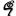

## References

​                [Deep Learning](https://www.deeplearningbook.org/)      

​                [Generative adversarial network - Wikipedia](https://en.wikipedia.org/wiki/Generative_adversarial_network)      

​                [Generative Adversarial Nets - 5423-generative-adversarial-nets.pdf](https://papers.nips.cc/paper/5423-generative-adversarial-nets.pdf)      

​                [Yoshua Bengio -](https://yoshuabengio.org/)      

​                [Aaron Courville - Google Scholar Citations](https://scholar.google.com/citations?user=km6CP8cAAAAJ&hl=en)      

​                [Aaron Courville](https://aaroncourville.wordpress.com/)      

​                [Apple Machine Learning Journal](https://machinelearning.apple.com/)      

​                [Feature learning - Wikipedia](https://en.wikipedia.org/wiki/Feature_learning)      

​                [What Is Deep Learning? | How It Works, Techniques & Applications - MATLAB & Simulink](https://www.mathworks.com/discovery/deep-learning.html)      

​                [Artificial intelligence - Wikipedia](https://en.wikipedia.org/wiki/Artificial_intelligence)      

​                [What is Artificial Intelligence? How Does AI Work? | Built In](https://builtin.com/artificial-intelligence)      

​                [artificial intelligence | Definition, Examples, and Applications | Britannica](https://www.britannica.com/technology/artificial-intelligence)      

​                [Pong - Wikipedia](https://en.wikipedia.org/wiki/Pong)      

​                [AlphaGo - Wikipedia](https://en.wikipedia.org/wiki/AlphaGo)      

​                [AlphaGo | DeepMind](https://deepmind.com/research/case-studies/alphago-the-story-so-far)      

​                [AlphaGo](https://www.alphagomovie.com/)      

​                [Symbolic Systems | Stanford University](https://exploredegrees.stanford.edu/schoolofhumanitiesandsciences/symbolicsystems/)      

​                [Easy TensorFlow - 1- Graph and Session](https://www.easy-tensorflow.com/tf-tutorials/basics/graph-and-session)      

​                [shallow vs deep: the great watershed in learning. - ORF523_S17_Lec17_guest.pdf](http://www.princeton.edu/~aaa/Public/Teaching/ORF523/S17/ORF523_S17_Lec17_guest.pdf)      

​                [Frontiers  | A Comparison of Shallow and Deep Learning Methods for Predicting  Cognitive Performance of Stroke Patients From MRI Lesion Images |  Frontiers in Neuroinformatics](https://www.frontiersin.org/articles/10.3389/fninf.2019.00053/full)      

​                [deep-learning.pdf](http://www.cnbc.cmu.edu/~plaut/IntroPDP/slides/deep-learning.pdf)      

​                [Support-vector machine - Wikipedia](https://en.wikipedia.org/wiki/Support-vector_machine)      

​                [Residual neural network - Wikipedia](https://en.wikipedia.org/wiki/Residual_neural_network)      

​                [Home Page of Geoffrey Hinton](https://www.cs.toronto.edu/~hinton/)      

​                [Deep belief network - Wikipedia](https://en.wikipedia.org/wiki/Deep_belief_network)      

​                [Deep belief networks - Scholarpedia](http://www.scholarpedia.org/article/Deep_belief_networks)      

​                [nipstut3.pdf - nipstut3.pdf](https://www.cs.toronto.edu/~hinton/nipstutorial/nipstut3.pdf)      

​                [Tutorials List - Javatpoint](https://www.javatpoint.com/)      

​                [Artificial intelligence - Reasoning | Britannica](https://www.britannica.com/technology/artificial-intelligence/Reasoning)      

​                [Cognition - Wikipedia](https://en.wikipedia.org/wiki/Cognition)      

​                [Cognition - an overview | ScienceDirect Topics](https://www.sciencedirect.com/topics/medicine-and-dentistry/cognition)      

​                [Consciousness - Wikipedia](https://en.wikipedia.org/wiki/Consciousness)      

​                [Artificial Intelligence: Does Consciousness Matter?](https://www.ncbi.nlm.nih.gov/pmc/articles/PMC6614488/)      

​                [Artificial Intelligence](http://www2.psych.utoronto.ca/users/reingold/courses/ai/consciousness.html)      

​                [Qualia - Wikipedia](https://en.wikipedia.org/wiki/Qualia)      

​                [Qualia (Stanford Encyclopedia of Philosophy)](https://plato.stanford.edu/entries/qualia/)      

​                [Multimodal learning - Wikipedia](https://en.wikipedia.org/wiki/Multimodal_learning)      

​                [Multimodal data as a means to understand the learning experience - ScienceDirect](https://www.sciencedirect.com/science/article/pii/S0268401218312751)      

​                [1705.09406.pdf](https://arxiv.org/pdf/1705.09406.pdf)      

​                [Dealing with Multimodal Data - What Does Good Data look like? | Coursera](https://www.coursera.org/lecture/data-machine-learning/dealing-with-multimodal-data-0u3Qh)      

​                [Hidden Voice Commands | USENIX](https://www.usenix.org/conference/usenixsecurity16/technical-sessions/presentation/carlini)      

​                [2016_usenix_hiddenvoicecommands.pdf](https://nicholas.carlini.com/papers/2016_usenix_hiddenvoicecommands.pdf)      

​                [Peter Norvig](https://norvig.com/)      

​                [Artificial Intelligence: A Modern Approach](http://aima.cs.berkeley.edu/)      

​                [Boltzmann machine - Wikipedia](https://en.wikipedia.org/wiki/Boltzmann_machine)      

​                [boltz321.pdf](https://www.cs.toronto.edu/~hinton/csc321/readings/boltz321.pdf)      

​                [Backpropagation - Wikipedia](https://en.wikipedia.org/wiki/Backpropagation)      

​                [Bayesian optimization - Wikipedia](https://en.wikipedia.org/wiki/Bayesian_optimization)      

​                [[1807.02811\] A Tutorial on Bayesian Optimization](https://arxiv.org/abs/1807.02811)      

​                [Gaussian process - Wikipedia](https://en.wikipedia.org/wiki/Gaussian_process)      

​                [Long short-term memory - Wikipedia](https://en.wikipedia.org/wiki/Long_short-term_memory)      

​                [Neural Turing machine - Wikipedia](https://en.wikipedia.org/wiki/Neural_Turing_machine)      

​                [Neural Turing Machines.pptx - NeuralTuringMachines.pdf](http://www.robots.ox.ac.uk/~tvg/publications/talks/NeuralTuringMachines.pdf)      

​                [Generative adversarial network - Wikipedia](https://en.wikipedia.org/wiki/Generative_adversarial_network)      

​                [Adverarial Nets](https://cs.stanford.edu/people/karpathy/gan/)      

​                [Nash equilibrium - Wikipedia](https://en.wikipedia.org/wiki/Nash_equilibrium)      

​                [The Nash equilibrium: A perspective | PNAS](https://www.pnas.org/content/101/12/3999)      

​                [iess_B3_H-O - NashEquilibrium.pdf](http://www.columbia.edu/~rs328/NashEquilibrium.pdf)      

​                [- Vaishnavh Nagarajan](https://www.cs.cmu.edu/~vaishnan/home/index.html)      

​                [[1902.04742\] Uniform convergence may be unable to explain generalization in deep learning](https://arxiv.org/abs/1902.04742)      

​                [Deep Image Prior](https://dmitryulyanov.github.io/deep_image_prior)      

​                [Deep Image Prior - Wikipedia](https://en.wikipedia.org/wiki/Deep_Image_Prior)      

​                [Conditional Image Generation with PixelCNN Decoders - 6527-conditional-image-generation-with-pixelcnn-decoders.pdf](https://papers.nips.cc/paper/6527-conditional-image-generation-with-pixelcnn-decoders.pdf)      

​                [PixelCNN | Bounded Rationality](http://bjlkeng.github.io/posts/pixelcnn/)      

​                [CIFAR-10 and CIFAR-100 datasets](https://www.cs.toronto.edu/~kriz/cifar.html)      

​                [Bing Xu's research works | Université de Montréal, Montréal (UdeM) and other places](https://www.researchgate.net/scientific-contributions/2009213940_Bing_Xu)      

​                [Bing Xu - Google Scholar Citations](https://scholar.google.com/citations?user=nHh9PSsAAAAJ&hl=en)      

​                [[1506.05751\] Deep Generative Image Models using a Laplacian Pyramid of Adversarial Networks](https://arxiv.org/abs/1506.05751)      

​                [[1511.06434\] Unsupervised Representation Learning with Deep Convolutional Generative Adversarial Networks](https://arxiv.org/abs/1511.06434)      

​                [[1606.03498\] Improved Techniques for Training GANs](https://arxiv.org/abs/1606.03498)      

​                [UZH - Brain Research Institute](https://www.hifo.uzh.ch/en.html)      

​                [[1809.11096\] Large Scale GAN Training for High Fidelity Natural Image Synthesis](https://arxiv.org/abs/1809.11096)      

​                [ajbrock/BigGAN-PyTorch: The author's officially unofficial PyTorch BigGAN implementation.](https://github.com/ajbrock/BigGAN-PyTorch)      

​                [ImageNet](http://www.image-net.org/)      

​                [CycleGAN Project Page](https://junyanz.github.io/CycleGAN/)      

​                [Domain adaptation - Wikipedia](https://en.wikipedia.org/wiki/Domain_adaptation)      

​                [1000x Faster Data Augmentation – The Berkeley Artificial Intelligence Research Blog](https://bair.berkeley.edu/blog/2019/06/07/data_aug/)      

​                [greenelab/SPRINT_gan: Privacy-preserving generative deep neural networks support clinical data sharing](https://github.com/greenelab/SPRINT_gan)      

​                [PATE-GAN: Generating Synthetic Data with Differential Privacy Guarantees | OpenReview](https://openreview.net/forum?id=S1zk9iRqF7)      

​                [Association for the Advancement of Artificial Intelligence](https://www.aaai.org/)      

​                [Nvidia Can Turn Day into Night, Cat into Lion with AI-Generated Images | PCMag](https://www.pcmag.com/news/nvidia-can-turn-day-into-night-cat-into-lion-with-ai-generated-images)      

​                [mingyuliutw/UNIT: Unsupervised Image-to-Image Translation](https://github.com/mingyuliutw/unit)      

​                [NVIDIA Researchers Showcase Major Advances in Deep Learning at NIPS | NVIDIA Blog](https://blogs.nvidia.com/blog/2017/12/03/nvidia-research-nips/)      

​                [This AI Can Change Weather, Seasons, and Time of Day in Photos](https://petapixel.com/2017/12/05/ai-can-change-weather-seasons-time-day-photos/)      

​                [Truepic | Photo and video verification platform](https://truepic.com/)      

​                [Large-scale CelebFaces Attributes (CelebA) Dataset](http://mmlab.ie.cuhk.edu.hk/projects/CelebA.html)      

​                [Cynthia Dwork | Simons Institute for the Theory of Computing](https://simons.berkeley.edu/people/cynthia-dwork)      

​                [The Turing Test (Stanford Encyclopedia of Philosophy)](https://plato.stanford.edu/entries/turing-test/)      

​                [AGI](http://www.agi-society.org/)      

​                [QR code - Wikipedia](https://en.wikipedia.org/wiki/QR_code)      

​                [Artificial General Intelligence - Scholarpedia](http://www.scholarpedia.org/article/Artificial_General_Intelligence)      

​                [A Beginner's Guide to Deep Reinforcement Learning | Pathmind](https://pathmind.com/wiki/deep-reinforcement-learning)      

​                [Reinforcement learning - Wikipedia](https://en.wikipedia.org/wiki/Reinforcement_learning)      

​                [dbobrenko/ai-learning-environments: List of environments and competitions for RL and AI training](https://github.com/dbobrenko/ai-learning-environments)      

​                [[1910.04404\] AI for Explaining Decisions in Multi-Agent Environments](https://arxiv.org/abs/1910.04404)      

​                [openai/multiagent-particle-envs:  Code for a multi-agent particle environment used in the paper  "Multi-Agent Actor-Critic for Mixed Cooperative-Competitive  Environments"](https://github.com/openai/multiagent-particle-envs)      

​                [Neural MMO: A Massively Multiagent Game Environment](https://openai.com/blog/neural-mmo/)      

​                [The Turing Test (Stanford Encyclopedia of Philosophy)](https://plato.stanford.edu/entries/turing-test/)      

​                [Turing test | Definition & Facts | Britannica](https://www.britannica.com/technology/Turing-test)      

​                [Artificial Intelligence | The Turing Test](http://www2.psych.utoronto.ca/users/reingold/courses/ai/turing.html)      

​                [AutoML](https://www.automl.org/automl/)      

​                [Automated machine learning - Wikipedia](https://en.wikipedia.org/wiki/Automated_machine_learning)      

​                [Google's AutoML: Cutting Through the Hype · fast.ai](https://www.fast.ai/2018/07/23/auto-ml-3/)      

​                [How secure are your AI and machine learning projects? | CSO Online](https://www.csoonline.com/article/3434610/how-secure-are-your-ai-and-machine-learning-projects.html)      

​                [Secure Machine Learning, a Brief Overview - IEEE Conference Publication](https://ieeexplore.ieee.org/document/6004498?denied=)      

​                [[1905.10291\] Privacy Risks of Securing Machine Learning Models against Adversarial Examples](https://arxiv.org/abs/1905.10291)      

​                [m26- - s8124.pdf](http://assets.press.princeton.edu/chapters/s8124.pdf)      

 